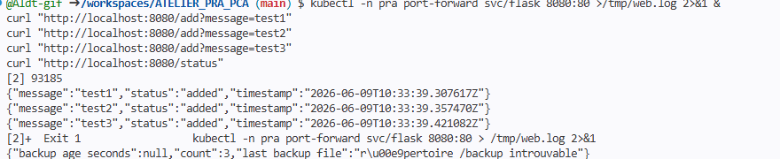
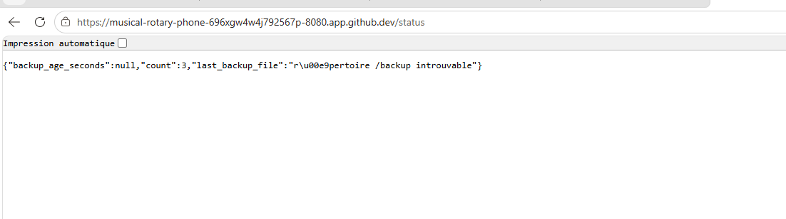

------------------------------------------------------------------------------------------------------
ATELIER PRA/PCA
------------------------------------------------------------------------------------------------------
L’idée en 30 secondes : Cet atelier met en œuvre un **mini-PRA** sur **Kubernetes** en déployant une **application Flask** avec une **base SQLite** stockée sur un **volume persistant (PVC pra-data)** et des **sauvegardes automatiques réalisées chaque minute vers un second volume (PVC pra-backup)** via un **CronJob**. L’**image applicative est construite avec Packer** et le **déploiement orchestré avec Ansible**, tandis que Kubernetes assure la gestion des pods et de la disponibilité applicative. Nous observerons la différence entre **disponibilité** (recréation automatique des pods sans perte de données) et **reprise après sinistre** (perte volontaire du volume de données puis restauration depuis les backups), nous mesurerons concrètement les RTO et RPO, et comprendrons les limites d’un PRA local non répliqué. Cet atelier illustre de manière pratique les principes de continuité et de reprise d’activité, ainsi que le rôle respectif des conteneurs, du stockage persistant et des mécanismes de sauvegarde.
  
**Architecture cible :** Ci-dessous, voici l'architecture cible souhaitée.   
  
  
  
-------------------------------------------------------------------------------------------------------
Séquence 1 : Codespace de Github
-------------------------------------------------------------------------------------------------------
Objectif : Création d'un Codespace Github  
Difficulté : Très facile (~5 minutes)
-------------------------------------------------------------------------------------------------------
**Faites un Fork de ce projet**. Si besoin, voici une vidéo d'accompagnement pour vous aider à "Forker" un Repository Github : [Forker ce projet](https://youtu.be/p33-7XQ29zQ) 
  
Ensuite depuis l'onglet **[CODE]** de votre nouveau Repository, **ouvrez un Codespace Github**.
  
---------------------------------------------------
Séquence 2 : Création du votre environnement de travail
---------------------------------------------------
Objectif : Créer votre environnement de travail  
Difficulté : Simple (~10 minutes)
---------------------------------------------------
Vous allez dans cette séquence mettre en place un cluster Kubernetes K3d contenant un master et 2 workers, installer les logiciels Packer et Ansible. Depuis le terminal de votre Codespace copier/coller les codes ci-dessous étape par étape :  

**Création du cluster K3d**  
```
curl -s https://raw.githubusercontent.com/k3d-io/k3d/main/install.sh | bash
```
```
k3d cluster create pra \
  --servers 1 \
  --agents 2
```
**vérification de la création de votre cluster Kubernetes**  
```
kubectl get nodes
```
**Installation du logiciel Packer (création d'images Docker)**  
```
PACKER_VERSION=1.11.2
curl -fsSL -o /tmp/packer.zip \
  "https://releases.hashicorp.com/packer/${PACKER_VERSION}/packer_${PACKER_VERSION}_linux_amd64.zip"
sudo unzip -o /tmp/packer.zip -d /usr/local/bin
rm -f /tmp/packer.zip
```
**Installation du logiciel Ansible**  
```
python3 -m pip install --user ansible kubernetes PyYAML jinja2
export PATH="$HOME/.local/bin:$PATH"
ansible-galaxy collection install kubernetes.core
```
  
---------------------------------------------------
Séquence 3 : Déploiement de l'infrastructure
---------------------------------------------------
Objectif : Déployer l'infrastructure sur le cluster Kubernetes
Difficulté : Facile (~15 minutes)
---------------------------------------------------  
Nous allons à présent déployer notre infrastructure sur Kubernetes. C'est à dire, créér l'image Docker de notre application Flask avec Packer, déposer l'image dans le cluster Kubernetes et enfin déployer l'infratructure avec Ansible (Création du pod, création des PVC et les scripts des sauvegardes aututomatiques).  

**Création de l'image Docker avec Packer**  
```
packer init .
packer build -var "image_tag=1.0" .
docker images | head
```
  
**Import de l'image Docker dans le cluster Kubernetes**  
```
k3d image import pra/flask-sqlite:1.0 -c pra
```
  
**Déploiment de l'infrastructure dans Kubernetes**  
```
ansible-playbook ansible/playbook.yml
```
  
**Forward du port 8080 qui est le port d'exposition de votre application Flask**  
```
kubectl -n pra port-forward svc/flask 8080:80 >/tmp/web.log 2>&1 &
```
  
---------------------------------------------------  
**Réccupération de l'URL de votre application Flask**. Votre application Flask est déployée sur le cluster K3d. Pour obtenir votre URL cliquez sur l'onglet **[PORTS]** dans votre Codespace (à coté de Terminal) et rendez public votre port 8080 (Visibilité du port). Ouvrez l'URL dans votre navigateur et c'est terminé.  

**Les routes** à votre disposition sont les suivantes :  
1. https://...**/** affichera dans votre navigateur "Bonjour tout le monde !".
2. https://...**/health** pour voir l'état de santé de votre application.
3. https://...**/add?message=test** pour ajouter un message dans votre base de données SQLite.
4. https://...**/count** pour afficher le nombre de messages stockés dans votre base de données SQLite.
5. https://...**/consultation** pour afficher les messages stockés dans votre base de données.
  
---------------------------------------------------  
### Processus de sauvegarde de la BDD SQLite

Grâce à une tâche CRON déployée par Ansible sur le cluster Kubernetes (un CronJob), toutes les minutes une sauvegarde de la BDD SQLite est faite depuis le PVC pra-data vers le PCV pra-backup dans Kubernetes.  

Pour visualiser les sauvegardes périodiques déposées dans le PVC pra-backup, coller les commandes suivantes dans votre terminal Codespace :  

```
kubectl -n pra run debug-backup \
  --rm -it \
  --image=alpine \
  --overrides='
{
  "spec": {
    "containers": [{
      "name": "debug",
      "image": "alpine",
      "command": ["sh"],
      "stdin": true,
      "tty": true,
      "volumeMounts": [{
        "name": "backup",
        "mountPath": "/backup"
      }]
    }],
    "volumes": [{
      "name": "backup",
      "persistentVolumeClaim": {
        "claimName": "pra-backup"
      }
    }]
  }
}'
```
```
ls -lh /backup
```
**Pour sortir du cluster et revenir dans le terminal**
```
exit
```

---------------------------------------------------
Séquence 4 : 💥 Scénarios de crash possibles  
Difficulté : Facile (~30 minutes)
---------------------------------------------------
### 🎬 **Scénario 1 : PCA — Crash du pod**  
Nous allons dans ce scénario **détruire notre Pod Kubernetes**. Ceci simulera par exemple la supression d'un pod accidentellement, ou un pod qui crash, ou un pod redémarré, etc..

**Destruction du pod :** Ci-dessous, la cible de notre scénario   
  
  

Nous perdons donc ici notre application mais pas notre base de données puisque celle-ci est déposée dans le PVC pra-data hors du pod.  

Copier/coller le code suivant dans votre terminal Codespace pour détruire votre pod :
```
kubectl -n pra get pods
```
Notez le nom de votre pod qui est différent pour tout le monde.  
Supprimez votre pod (pensez à remplacer <nom-du-pod-flask> par le nom de votre pod).  
Exemple : kubectl -n pra delete pod flask-7c4fd76955-abcde  
```
kubectl -n pra delete pod <nom-du-pod-flask>
```
**Vérification de la suppression de votre pod**
```
kubectl -n pra get pods
```
👉 **Le pod a été reconstruit sous un autre identifiant**.  
Forward du port 8080 du nouveau service  
```
kubectl -n pra port-forward svc/flask 8080:80 >/tmp/web.log 2>&1 &
```
Observez le résultat en ligne  
https://...**/consultation** -> Vous n'avez perdu aucun message.
  
👉 Kubernetes gère tout seul : Aucun impact sur les données ou sur votre service (PVC conserve la DB et le pod est reconstruit automatiquement) -> **C'est du PCA**. Tout est automatique et il n'y a aucune rupture de service.
  
---------------------------------------------------
### 🎬 **Scénario 2 : PRA - Perte du PVC pra-data** 
Nous allons dans ce scénario **détruire notre PVC pra-data**. C'est à dire nous allons suprimer la base de données en production. Ceci simulera par exemple la corruption de la BDD SQLite, le disque du node perdu, une erreur humaine, etc. 💥 Impact : IL s'agit ici d'un impact important puisque **la BDD est perdue**.  

**Destruction du PVC pra-data :** Ci-dessous, la cible de notre scénario   
  
  

🔥 **PHASE 1 — Simuler le sinistre (perte de la BDD de production)**  
Copier/coller le code suivant dans votre terminal Codespace pour détruire votre base de données :
```
kubectl -n pra scale deployment flask --replicas=0
```
```
kubectl -n pra patch cronjob sqlite-backup -p '{"spec":{"suspend":true}}'
```
```
kubectl -n pra delete job --all
```
```
kubectl -n pra delete pvc pra-data
```
👉 Vous pouvez vérifier votre application en ligne, la base de données est détruite et la service n'est plus accéssible.  

✅ **PHASE 2 — Procédure de restauration**  
Recréer l’infrastructure avec un PVC pra-data vide.  
```
kubectl apply -f k8s/
```
Vérification de votre application en ligne.  
Forward du port 8080 du service pour tester l'application en ligne.  
```
kubectl -n pra port-forward svc/flask 8080:80 >/tmp/web.log 2>&1 &
```
https://...**/count** -> =0.  
https://...**/consultation** Vous avez perdu tous vos messages.  

Retaurez votre BDD depuis le PVC Backup.  
```
kubectl apply -f pra/50-job-restore.yaml
```
👉 Vous pouvez vérifier votre application en ligne, **votre base de données a été restaureé** et tous vos messages sont bien présents.  

Relance des CRON de sauvgardes.  
```
kubectl -n pra patch cronjob sqlite-backup -p '{"spec":{"suspend":false}}'
```
👉 Nous n'avons pas perdu de données mais Kubernetes ne gère pas la restauration tout seul. Nous avons du protéger nos données via des sauvegardes régulières (du PVC pra-data vers le PVC pra-backup). -> **C'est du PRA**. Il s'agit d'une stratégie de sauvegarde avec une procédure de restauration.  

---------------------------------------------------
Séquence 5 : Exercices  
Difficulté : Moyenne (~45 minutes)
---------------------------------------------------
**Complétez et documentez ce fichier README.md** pour répondre aux questions des exercices.  
Faites preuve de pédagogie et soyez clair dans vos explications et procedures de travail.  

**Exercice 1 :**  
Quels sont les composants dont la perte entraîne une perte de données ?  
  
La perte de données survient uniquement si le PVC pra-data est supprimé ou corrompu. C'est lui qui stocke la base SQLite en dehors du pod.

**Exercice 2 :**  
Expliquez nous pourquoi nous n'avons pas perdu les données lors de la supression du PVC pra-data  
  
Parce qu'un CronJob Kubernetes sauvegarde automatiquement la base SQLite toutes les minutes depuis le PVC pra-data vers le PVC pra-backup.

**Exercice 3 :**  
Quels sont les RTO et RPO de cette solution ?  
  
RPO (Recovery Point Objective) — jusqu'où remonte-t-on dans le temps lors d'une restauration ?
Le CronJob tourne toutes les minutes. Dans le pire cas, on perd les données ajoutées dans la minute précédant le sinistre.
→ RPO ≈ 1 minute
RTO (Recovery Time Objective) — combien de temps pour que le service soit à nouveau opérationnel ?

**Exercice 4 :**  
Pourquoi cette solution (cet atelier) ne peux pas être utilisé dans un vrai environnement de production ? Que manque-t-il ?   
  
1. Stockage local non répliqué — Les PVC pra-data et pra-backup sont stockés sur le même nœud K3d (hostPath). Si le nœud physique tombe, les deux volumes sont perdus en même temps. Il n'y a aucune redondance géographique.
2. Single point of failure — Un seul pod applicatif, un seul nœud master. Aucune haute disponibilité.
3. Restauration 100% manuelle — Il n'existe pas de procédure automatique de failover. Un opérateur doit intervenir manuellement, ce qui allonge le RTO.
4. Pas de monitoring ni d'alerting — Aucun système ne détecte automatiquement un sinistre et ne déclenche la restauration.
5. SQLite n'est pas adapté à la production — SQLite ne supporte pas les accès concurrents multi-pods et ne peut pas être répliqué nativement.
6. Sauvegardes sur le même cluster — Si le cluster entier est perdu, les backups le sont aussi.
  
**Exercice 5 :**  
Proposez une archtecture plus robuste.   
  
Stockage

Remplacer SQLite par PostgreSQL avec réplication primaire/secondaire
Utiliser un StorageClass réseau (Longhorn, Ceph, NFS) pour des PVC répliqués sur plusieurs nœuds
Exporter les sauvegardes vers un stockage externe au cluster (S3, Azure Blob, NFS distant) pour résister à la perte totale du cluster

Kubernetes

Cluster multi-nœuds (minimum 3 masters + 3 workers) pour la haute disponibilité
Pod Disruption Budget et replicas ≥ 2 pour le déploiement Flask
Liveness et Readiness probes pour la détection automatique des défaillances

Sauvegarde & Restauration

Outil dédié comme Velero pour les sauvegardes complètes du cluster (PVC + ressources K8s)
Sauvegardes vers un site distant (multi-zone ou multi-région)
Procédures de restauration testées et automatisées (runbook validé régulièrement)

Monitoring

Prometheus + Grafana pour surveiller l'état des pods, PVC et jobs
Alertmanager pour notifier en cas de sinistre
Tableau de bord dédié au suivi du RPO/RTO en temps réel

---------------------------------------------------
Séquence 6 : Ateliers  
Difficulté : Moyenne (~2 heures)
---------------------------------------------------
### **Atelier 1 : Ajoutez une fonctionnalité à votre application**  
**Ajouter une route GET /status** dans votre application qui affiche en JSON :
* count : nombre d’événements en base
* last_backup_file : nom du dernier backup présent dans /backup
* backup_age_seconds : âge du dernier backup




---------------------------------------------------
### **Atelier 2 : Choisir notre point de restauration**  
Aujourd’hui nous restaurobs “le dernier backup”. Nous souhaitons **ajouter la capacité de choisir un point de restauration**.

## Atelier 2 : Choisir notre point de restauration

### Runbook — Restauration vers un point précis

**Étape 1 — Lister les backups disponibles**
```bash
kubectl -n pra run debug-backup --rm -it --image=alpine \
  --overrides='{"spec":{"containers":[{"name":"debug","image":"alpine",
  "command":["ls","-lht","/backup"],"volumeMounts":[{"name":"backup",
  "mountPath":"/backup"}]}],"volumes":[{"name":"backup",
  "persistentVolumeClaim":{"claimName":"pra-backup"}}]}}'
```

**Étape 2 — Choisir le fichier de backup voulu et l'indiquer dans le YAML**
```bash
# Editer RESTORE_FILE dans pra/50-job-restore.yaml
# Remplacer value: "" par value: "nom_du_fichier.db"
```

**Étape 3 — Arrêter l'application et supprimer l'ancien job**
```bash
kubectl -n pra scale deployment flask --replicas=0
kubectl -n pra delete job sqlite-restore --ignore-not-found
```

**Étape 4 — Lancer la restauration**
```bash
kubectl apply -f pra/50-job-restore.yaml
```

**Étape 5 — Redémarrer l'application**
```bash
kubectl -n pra scale deployment flask --replicas=1
kubectl -n pra port-forward svc/flask 8080:80 >/tmp/web.log 2>&1 &
```

**Étape 6 — Vérifier la restauration**
```bash
curl http://localhost:8080/consultation
```  
  
---------------------------------------------------
Evaluation
---------------------------------------------------
Cet atelier PRA PCA, **noté sur 20 points**, est évalué sur la base du barème suivant :  
- Série d'exerices (5 points)
- Atelier N°1 - Ajout d'un fonctionnalité (4 points)
- Atelier N°2 - Choisir son point de restauration (4 points)
- Qualité du Readme (lisibilité, erreur, ...) (3 points)
- Processus travail (quantité de commits, cohérence globale, interventions externes, ...) (4 points) 

